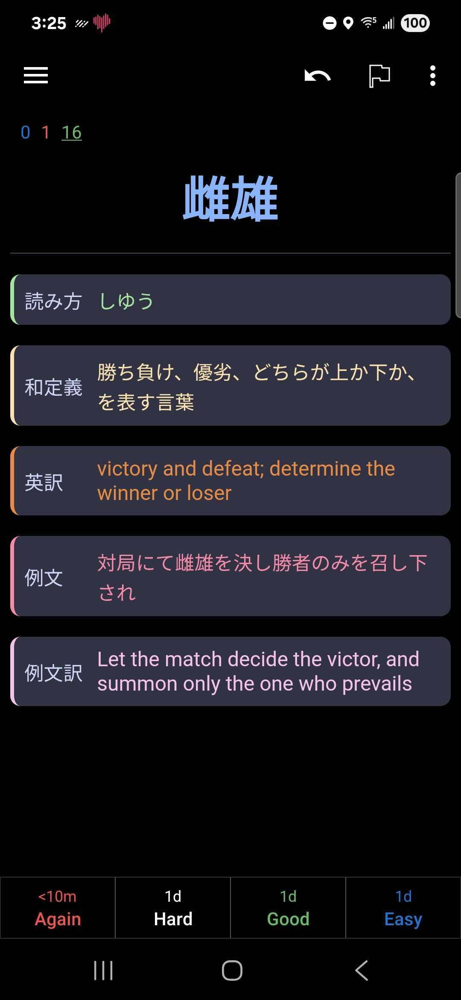

# Anki

Custom Anki theme for vocabulary cards.

## Description
This repository contains a custom theme for Anki vocabulary cards. It includes:
- `front.html`: The front template for the cards.
- `back.html`: The back template for the cards.
- `styling.css`: The CSS file for styling the cards.

The theme is inspired by the minimalist and elegant aesthetics of the Tomorrow Night color scheme, providing a dark mode experience with vibrant accent colors for readability.

## Preview
Below is a preview of the card design:

## Importing Using CrowdAnki
To import this theme into Anki using the CrowdAnki plugin:

1. Install the CrowdAnki plugin from the [AnkiWeb add-ons page](https://ankiweb.net/shared/addons/).
2. Open Anki and go to `File` > `CrowdAnki: Import From Disk`.
3. Select the folder containing the `deck.json` file from this repository.
4. The note type is named `Rename Me`. You can manually edit `deck.json` to give it a different name if desired.

## Manual Usage
If you prefer not to use the CrowdAnki plugin, you can manually copy the provided files:

1. Open Anki and navigate to the card type editor.
2. Replace the front template with the contents of `front.html`.
3. Replace the back template with the contents of `back.html`.
4. Replace the styling with the contents of `styling.css`.

Enjoy!
